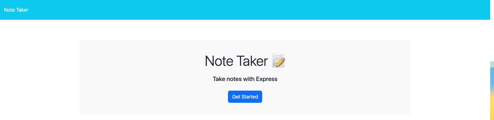
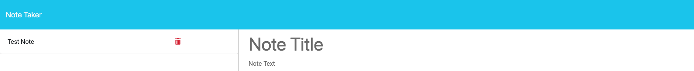

# Note Taker

## Description

Note Taker is a simple and intuitive web application that allows small business owners and individuals to write, save, and manage notes efficiently. With a user-friendly interface, users can quickly jot down thoughts and tasks, helping them stay organized and focused.

- **Motivation**: The motivation behind Note Taker is to provide a streamlined note-taking tool that is accessible and easy to use, catering to the organizational needs of small business owners.
- **Purpose**: This application serves as a digital notepad that is always within reach, enabling users to capture ideas and tasks on the go.
- **Problem it Solves**: Note Taker addresses the challenge of managing multiple pieces of information by offering a centralized platform for note management.
- **What I Learned**: Developing Note Taker has enhanced my skills in full-stack development, particularly in creating RESTful APIs with Express.js and deploying applications to Heroku.

## Installation

Access the live application here: [Note Taker](https://arcane-harbor-56139-6de82d664ec5.herokuapp.com/)

To run a local copy:
1. Clone the repository to your local machine.
2. Navigate to the cloned directory.
3. Install the necessary dependencies with `npm install`.
4. Start the server with `node server.js`.
5. Open your web browser and visit `http://localhost:3000`.

## Usage

Use Note Taker to keep track of your tasks and notes. Click on the link to the notes page to view existing notes or add new ones.

Here are some screenshots of the application:

## Credits

- The `uuid.js` helper function was sourced from the Week 11 Day 3 Activity 24 materials of the EdX Coding Bootcamp course.

## License

This project is licensed under the MIT License.
